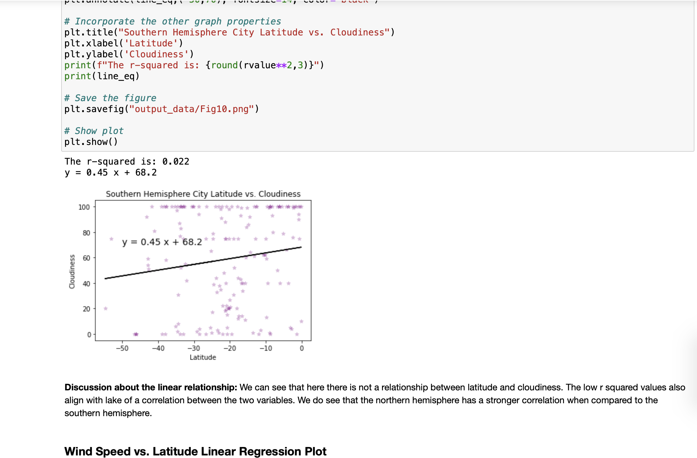
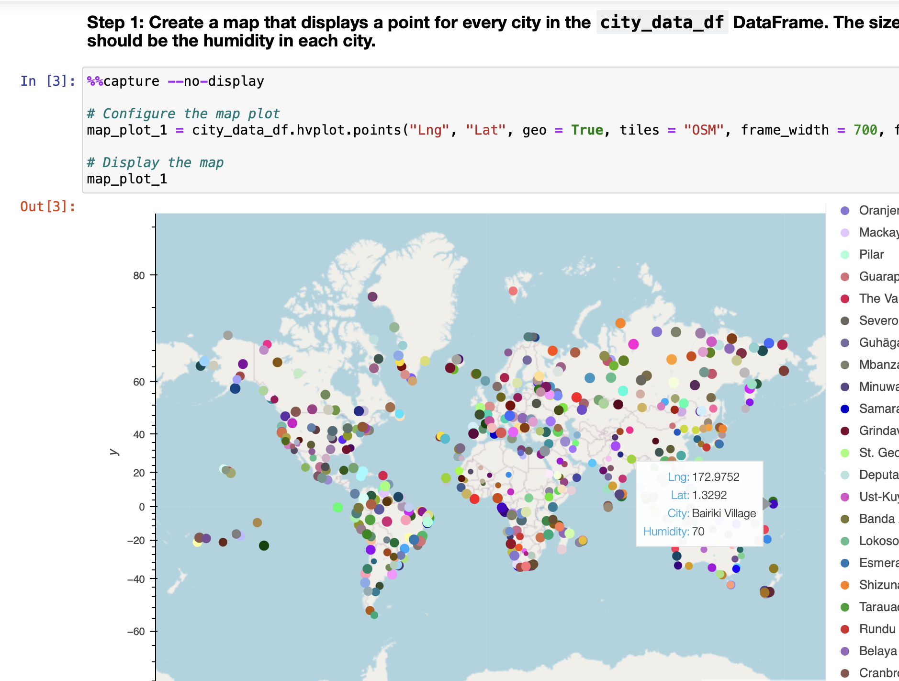
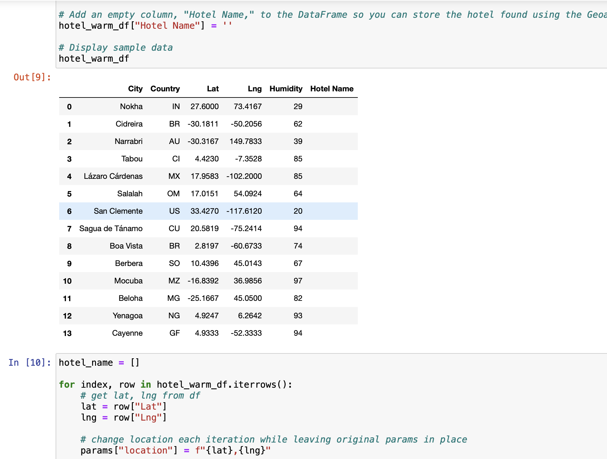
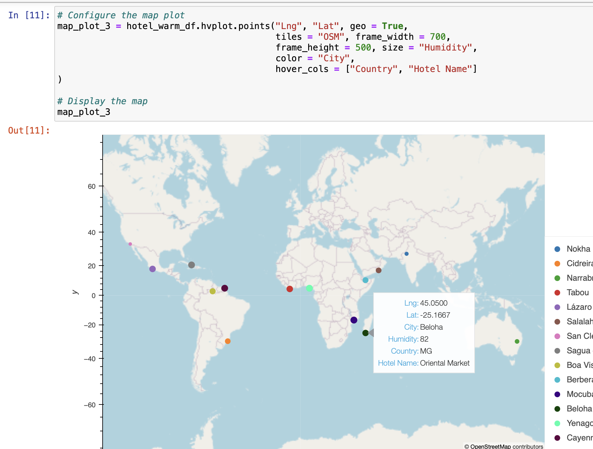

# python-api-challenge

## Overview of Project

### WeatherPY Instructions

    * Create Plots to Showcase the Relationship Between Weather Variables and Latitude
        * Create a scatter plot to showcase the relationship between Latitude vs. Temperature 
        * Create a scatter plot to showcase the relationship between Latitude vs. Humidity 
        * Create a scatter plot to showcase the relationship between Latitude vs. Cloudiness 
        * Create a scatter plot to showcase the relationship between Latitude vs. Wind Speed 
    * Compute Linear Regression for Each Relationship
        * Linear regression scatter plot for Northern Hemisphere: Temperature (C) vs. Latitude
        * Linear regression scatter plot for Southern Hemisphere: Temperature (C) vs. Latitude 
        * Linear regression scatter plot for Northern Hemisphere: Humidity (%) vs. Latitude 
        * Linear regression scatter plot for Southern Hemisphere: Humidity (%) vs. Latitude 
        * Linear regression scatter plot for Northern Hemisphere: Cloudiness (%) vs. Latitude
        * Linear regression scatter plot for Southern Hemisphere: Cloudiness (%) vs. Latitude
        * Linear regression scatter plot for Northern Hemisphere: Wind Speed (m/s) vs. Latitude 
        * Linear regression scatter plot for Southern Hemisphere: Wind Speed (m/s) vs. Latitude

### VacationPY Instructions
    * Create a map that displays a point for every city in the city_data_df DataFrame (5 points)
    * Narrow down the city_data_df DataFrame to find your ideal weather condition (5 points)
    * For each city in the hotel_df DataFrame, use the Geoapify API to find the first hotel located within 10,000 metres of your coordinates (10 points)
    * Add the hotel name and the country as additional information in the hover message for each city in the map. (10 points)

### Purpose

I am utilizing Python-API and Jupyter Notebook to analyze data from apis in order to get more detailed information about what the pulled data shows.

## Analysis and Challenges

### Analysis of Outcomes Based on Goals

* During this assignment I was able to complete all the goals and objectives for the assignment. I used what I have learned in the class to trouble shooting the code as I went with Jupyter Notebook and made sure I was fully understanding what each part of my code did through labeling, so when an error popped up I knew how to approach the problem.

### Challenges and Difficulties Encountered

* I think the biggest challenge for me was figured out how to creat the maps from the data. I hit a lot of errors and road blocks, but breaks and repetition won over and eventually I figured out what I needed to do.

### Jupyter Notebook

####Weather Py

####Vacation Py

## Results

* What are two conclusions you can draw about the data?

    * The varibles with the strongest correlation is in the northern hemisphere latitude vs. temperature.
    * The preferred weather places were closer to the equator when plotting them on the map.
